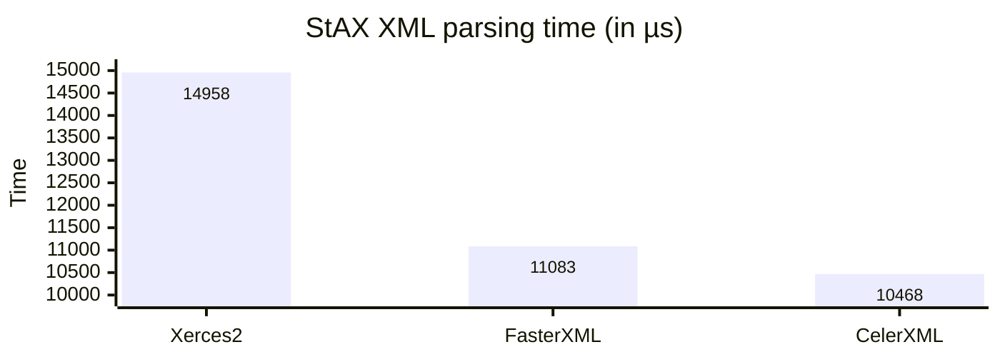
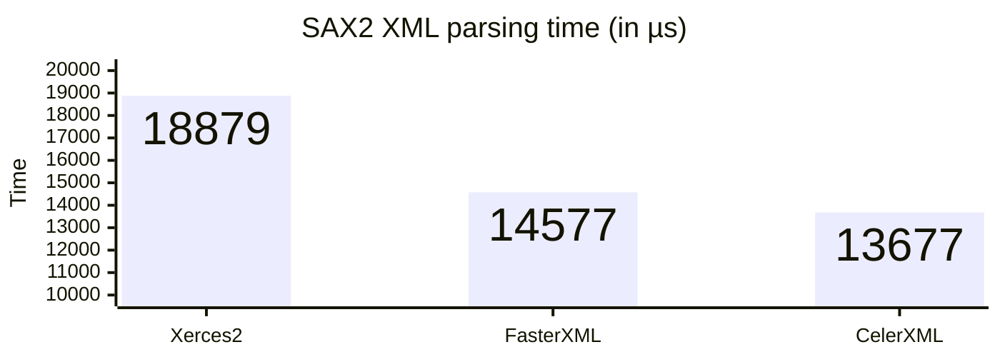
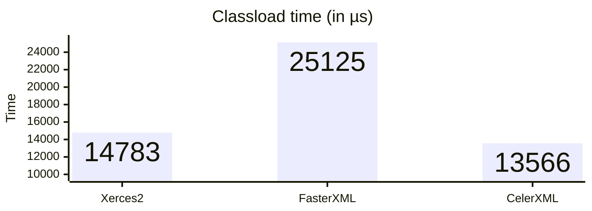

# Benchmark

This benchmark measures the average XML parsing time and the classload time for the selected XML processor. The following
processors were benchmarked:
 * *Xerces2* (the default XML processor)
 * *FasterXML/aalto-xml* v1.3.3
 * *CelerXML* v1.0.2

The following table summarizes the benchmark settings and environment:

|                 |               |
| ---------------:| :------------ |
| Iterations      | 10.000        |
| XML file size   | 1.361 Kb      |
| XML lines count | 42.161        |
| CPU             | i7 / 2.70 GHz |
| RAM             | 8 Gb          |

## Selecting the XML processor

Copy the XML processor jar file(s) into the `lib` subdirectory under the parent directory.
 * *Xerces2*: No files to copy because it's the default processor
 * *FasterXML/aalto-xml*: `aalto-xml-X.Y.Z.jar` and `stax2-api-X.Y.Z.jar`
 * *CelerXML*: `celerxml-X.Y.Z.jar`

**Note:** Make sure no other jar files are left in the `lib` subdirectory.

Edit the `run_benchmark.bat` batch file to select the XML parser by uncommenting the corresponding `SET J_XML_OVERRIDE` line.

Run `run_benchmark.bat` to launch the benchmark.

## Sample XML files for the benchmark

Several sample XML files are included:

| XML file                                       | Description                 |
| ----------------------------------------------:| :-------------------------- |
| [excel_test.xml](files/excel_test.xml)         | Simple Excel test file      |
| [large_xml_file.xml](files/large_xml_file.xml) | Mystic library              |
| [sheet1.xml](files/sheet1.xml)                 | OpenXML Spreadsheet         |
| [test-opc.xml](files/test-opc.xml)             | Sample OPC Data Access file |
| [test.xml](files/test.xml)                     | Simple XML file             |

This report was generated using the Mystic library as the input XML file.

## Benchmark report

The following charts represent the performance indicators measured when benchmarking the XML parsers.

