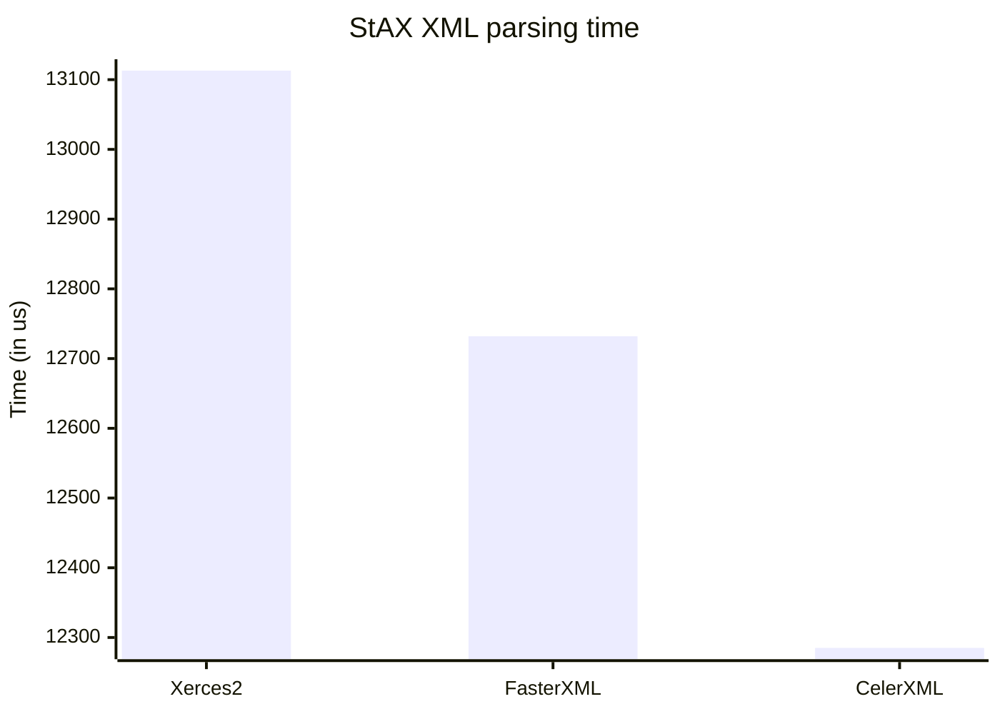
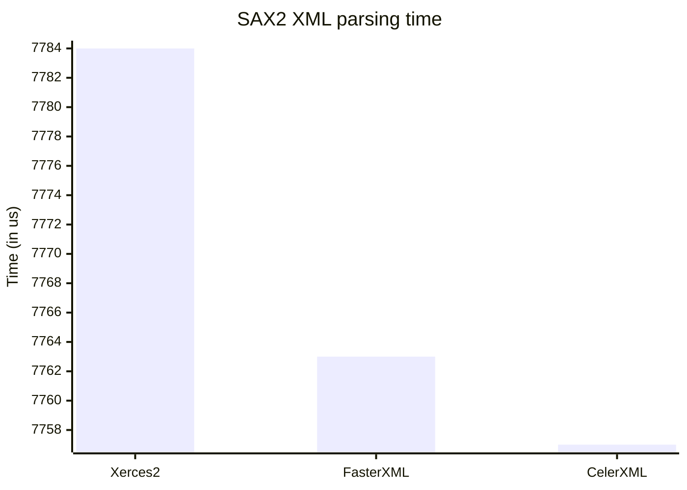
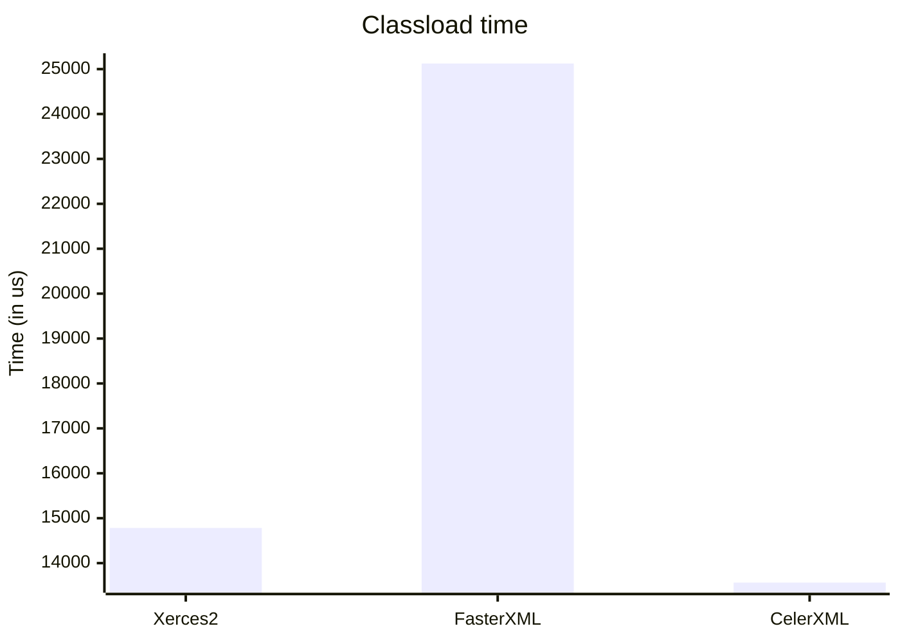

# Benchmark

This benchmark measures the average XML parsing time and the classload time for the selected XML parser. The following
parsers were benchmarked:
 * Xerces2 (the default parser)
 * FasterXML/aalto-xml v1.3.3
 * CelerXML v1.0.2

| ---------------:| :------------ |
| Iterations      | 5.000         |
| XML file size   | 1.361 Kb      |
| XML lines count | 42.161        |
| CPU             | i7 / 2.70 GHz |
| RAM             | 8 Gb          |

## StAX XML parsing time

## SAX2 XML parsing time

## Classload time

